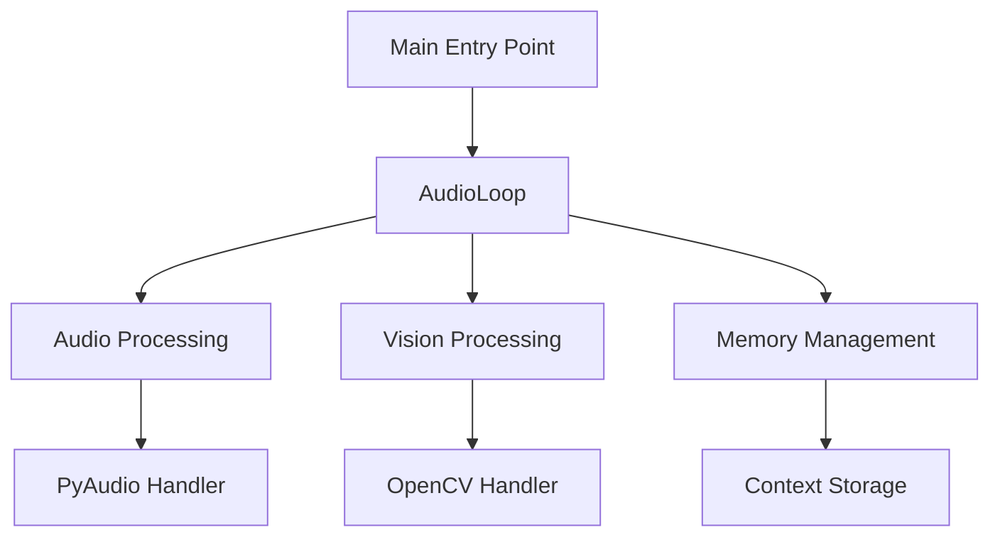
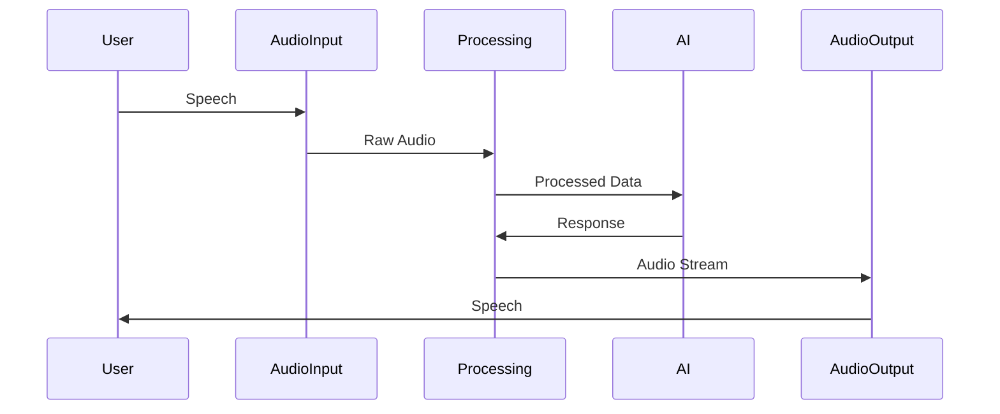
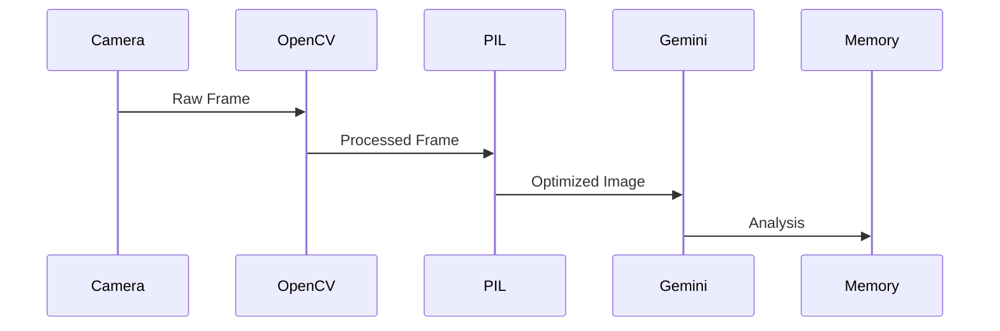

# Jarvis AI Technical Documentation 📚

## Table of Contents 📑

1. [System Architecture](#system-architecture)
2. [Core Components](#core-components)
3. [AI Modes](#ai-modes)
4. [Technical Specifications](#technical-specifications)
5. [Data Flow](#data-flow)

## System Architecture 🏗️

### Component Overview



### Directory Structure 📁

| Directory | Purpose | Key Files |
|-----------|---------|-----------|
| `/funciones` | Core Modules | audio_def.py, video_def.py, basic_def.py |
| `/data` | Configuration | config.json, modes/*.txt |

## Core Components 🔧

### Audio System

| Component | Specification | Notes |
|-----------|--------------|-------|
| Sample Rate (Send) | 16000 Hz | Optimized for speech |
| Sample Rate (Receive) | 24000 Hz | Enhanced quality |
| Format | PyAudio.paInt16 | 16-bit PCM |
| Channels | 1 (Mono) | Reduced bandwidth |
| Chunk Size | 2048 | Balanced latency |

### Video System

| Feature | Implementation | Purpose |
|---------|---------------|----------|
| Frame Capture | OpenCV | Real-time video |
| Frame Processing | PIL | Image optimization |
| Data Format | JPEG | Efficient transfer |
| Resolution | Dynamic | Adaptive quality |

### Memory System

```python
Memory Structure:
{
    "context": str,          # Conversation history
    "mode": str,            # Current AI mode
    "interaction_count": int # Session tracking
}
```

## AI Modes 🤖

### 1. Conversational Mode

| Feature | Implementation | Trigger |
|---------|---------------|---------|
| Context Save | Every 4 messages | Automatic |
| Language Style | Casual/Modern | Mode-specific |
| Memory Usage | Short-term | Session-based |

### 2. Psychologist Mode

| Feature | Implementation | Trigger |
|---------|---------------|---------|
| Context Save | Every 2 messages | Automatic |
| Language Style | Professional | Mode-specific |
| Memory Usage | Long-term | Persistent |

### 3. Lenses AI Mode

| Feature | Implementation | Trigger |
|---------|---------------|---------|
| Context Save | Every 3 observations | Scene change |
| Vision Analysis | Real-time | Continuous |
| Data Processing | Frame-by-frame | 30fps target |

## Technical Specifications 🔍

### API Integration

| Service | Purpose | Configuration |
|---------|---------|--------------|
| Google Gemini | Core AI | models/gemini-2.0-flash-live-001 |
| Google Search | Information | Grounding enabled |
| Speech Config | Voice output | Multi-voice support |

### Performance Metrics

| Metric | Target | Notes |
|--------|--------|-------|
| Audio Latency | <50ms | Real-time conversation |
| Frame Rate | 30fps | Smooth video |
| Response Time | <1s | AI processing |

### System Requirements

| Component | Minimum | Recommended |
|-----------|---------|-------------|
| Python | 3.12+ | 3.12+ |
| RAM | 4GB | 8GB |
| CPU | Dual Core | Quad Core |
| Storage | 500MB | 1GB |

## Data Flow 📊

### Audio Pipeline



### Vision Pipeline



## Error Handling 🛠️

| Error Type | Handler | Recovery Action |
|------------|---------|----------------|
| Audio Device | find_headset_devices() | Auto-reconnect |
| Connection Lost | reset_status_to_reconnect() | Delayed retry |
| Frame Drop | Async buffer | Skip frame |

## Configuration Options ⚙️

| Setting | File | Format |
|---------|------|--------|
| API Keys | config.json | JSON Array |
| Voice Settings | config.json | String |
| Mode Selection | config.json | String |

## Security Considerations 🔒

| Feature | Implementation | Purpose |
|---------|---------------|---------|
| API Keys | Environment Variables | Secure storage |
| User Data | Local storage | Privacy |
| Frame Data | Memory-only | No persistence |

## Development Guidelines 📝

### Code Style

```python
# Function Documentation Template
def function_name():
    """
    Purpose: What the function does
    Args: Input parameters
    Returns: Output specification
    """
```

### Testing Protocol

| Test Type | Scope | Frequency |
|-----------|-------|-----------|
| Audio | Device detection | Startup |
| Video | Frame capture | Continuous |
| Memory | Context save | Per interaction |

## Troubleshooting 🔧

| Issue | Check | Solution |
|-------|-------|----------|
| No Audio | Device config | Run device scan |
| No Video | Camera access | Reset capture |
| No Response | API status | Check connection |

---

*Last Updated: May 16, 2025*

*For support: github.com/optionIA*
