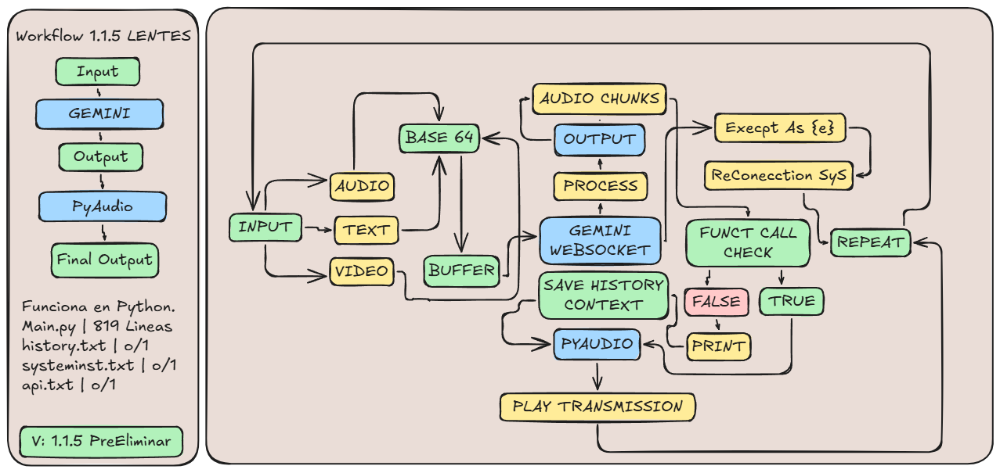
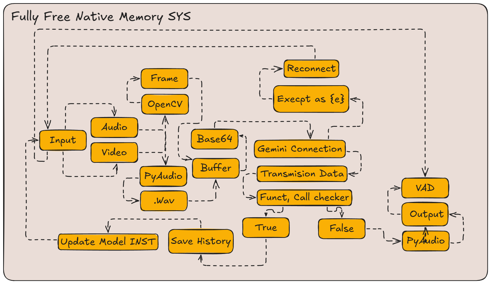
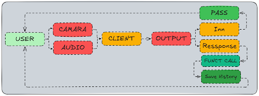

# Gemini-AI-lens-2025-
Gemini API Real-Time, glasses with built-in AI
🚀 **Proyecto innovador de gafas con inteligencia artificial integrada**, diseñadas para potenciar la interacción con el mundo real mediante visión asistida y procesamiento en tiempo real.

---

## 📌 Características
- 🌐 Visión asistida con IA
- ⚡ Procesamiento en tiempo real
- 🛠️ Integración con hardware optimizado
- 🎯 Diseñado para facilitar la accesibilidad y mejorar la experiencia del usuario

---
## 3 Modos Diferentes;
1. Psicologo
2. Conversacional
3. Lentes (activacion por voz)
---

## 🔍 Flujo de Trabajo
A continuación, se muestra el flujo de trabajo del sistema:  

### 🛠️ Sistema De Memoria Nativo

### ⚡ Reconnect Rate Limit (2 Mins limit to infinit workflow)


---

## 📂 Estructura del Proyecto
```
📦 Gafas-IA-Integradas
├── 📁 Notes              # Documentación y referencias
│   ├── 🖼️ workflow.png   # Diagrama del flujo de trabajo
|   ├── 🖼️ workflow22.png
|   ├── 🖼️ workflow21.png
├── 📂 Code_Source                # Código fuente
│   ├── 📜 main.py        # Archivo principal
│   ├── 📜 exe.py       # Text File (Here your gemini api key)
|   ├── 📂 data
│        ├── 📜 config.json
│        ├── 📜 current_mode.txt
│        ├── 📜 history_tool.txt
│        ├── 📜 status.txt
|   ├── 📂 Funciones
│        ├── 📜 audio_def.py
│        ├── 📜 basic_def.py
│        ├── 📜 pya_def.py
│        ├── 📜 config.py
├── 📄 README.md          # Este archivo
```
---
## Notes
### 📸 Galería de Imágenes

A continuación, algunas imágenes relacionadas con el proyecto:

<div style="display: grid; grid-template-columns: repeat(4, 1fr); gap: 10px;">
  
  
  
  
  
  
  
  
  
  
  
  
  
</div>

---

## 🚀 Instalación y Uso
1. Clonar el repositorio:
   ```bash
   git clone https://github.com/OptionIA/Gemini-AI-lens-2025-/tree/main
   ```
2. Instalar dependencias:
   ```bash
   pip install -r requirements.txt
   ```
3. Ejecutar el programa:
   ```bash
   python Code_Source/exe.py # Change folder name, due mayus
   ```

---

## ⚖️ Licencia
🚫 **Proyecto Privado** – Todos los derechos reservados.

---
